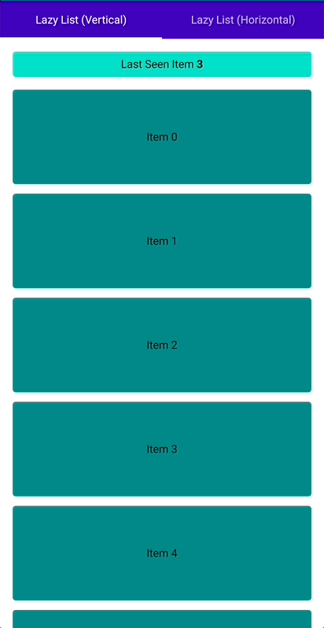
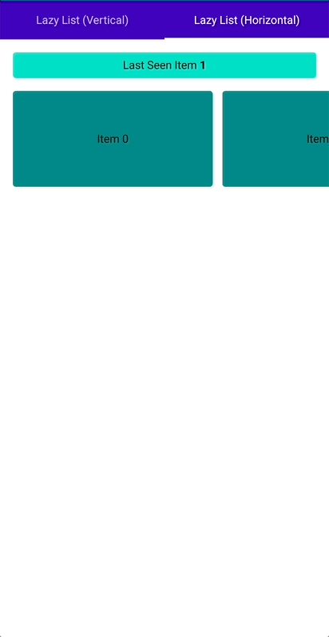

# Compose Impression

This library provides a way to track whether items appear on the screen in lazy lists.

|  |  |
| --------------------------------------------------- | ------------------------------------------------- |
| Lazy Column                                         | Lazy Row                                          |

## Usage

To use the impression, first create an `ImpressionState` with rememberImpressionState. Then, use the impression modifier to track impressions for items in your list.

⚠️ The item key you use in the lazy list has to be the same as the key you give to the impression modifier.

```kotlin
    val lazyListState = rememberLazyListState()
    val impressionState = rememberImpressionState(lazyListState)

    LaunchedEffect(Unit) {
        impressionState.seenEvent.collectLatest {
            // collect impression events
        }
    }

    LazyRow(
        modifier = modifier.fillMaxSize(),
        state = lazyListState,
        contentPadding = PaddingValues(16.dp),
        horizontalArrangement = Arrangement.spacedBy(12.dp)
    ) {
        items(list, key = { it }) {
            CardItem(
                key = it,
                modifier = Modifier
                    .width(250.dp)
                    .height(120.dp)
                    .impression(it, impressionState),
            )
        }
    }
```

or

```kotlin
    val lazyListState = rememberLazyListState()
    val impressionState = rememberImpressionState(lazyListState)

    LazyRow(
        modifier = modifier.fillMaxSize(),
        state = lazyListState,
        contentPadding = PaddingValues(16.dp),
        horizontalArrangement = Arrangement.spacedBy(12.dp)
    ) {
        items(list, key = { it }) {
            CardItem(
                key = it,
                modifier = Modifier
                    .width(250.dp)
                    .height(120.dp)
                    .impression(
                        key = it,
                        impressionState = impressionState,
                        onImpressionHappened = {
                            // collect impression event
                        }
                    ),
            )
        }
    }
```

## Validators

The `VisibilityPercentImpressionValidator` validates impressions based on the visibility percentage of an item.

```kotlin
val impressionState = rememberImpressionState(lazyListState) {
    addValidator(VisibilityPercentImpressionValidator(0.5f)) // set the visibility percentage threshold to 50%
}
```

With this configuration, when an item is 50% visible, the impression will be validated and happened.

You can create your own validator by extending from ImpressionValidator.

## Including in your project

[](https://github.com/erolaksoy/compose-impression#including-in-your-project)

1. Add the JitPack repository to your project-level `build.gradle` file:

```
allprojects {
    repositories {
        ...
        maven { url 'https://jitpack.io' }
    }
}
```

1. Add the dependency to your app-level `build.gradle` file:

```
dependencies {
    implementation 'com.github.erolaksoy:compose-impression:0.1.1'
}
```

1. Sync your project with Gradle files.

## License

```xml
Copyright 2023 Erol Aksoy

   Licensed under the Apache License, Version 2.0 (the "License");
   you may not use this file except in compliance with the License.
   You may obtain a copy of the License at

       http://www.apache.org/licenses/LICENSE-2.0

   Unless required by applicable law or agreed to in writing, software
   distributed under the License is distributed on an "AS IS" BASIS,
   WITHOUT WARRANTIES OR CONDITIONS OF ANY KIND, either express or implied.
   See the License for the specific language governing permissions and
   limitations under the License.
```
